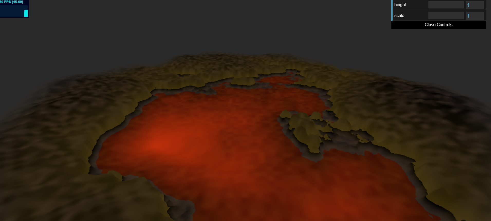
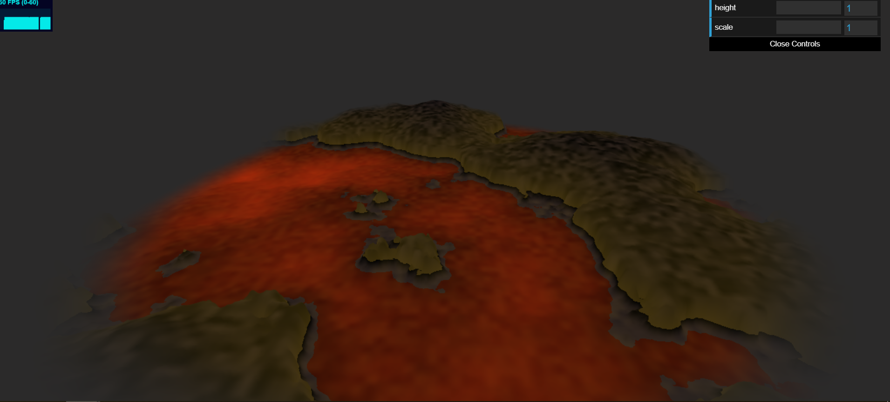
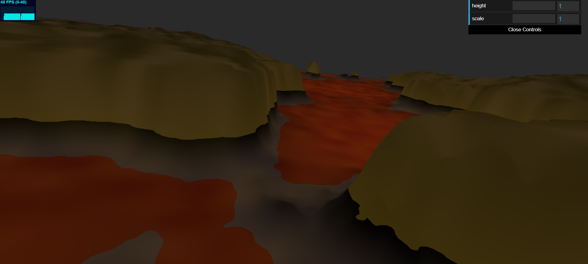
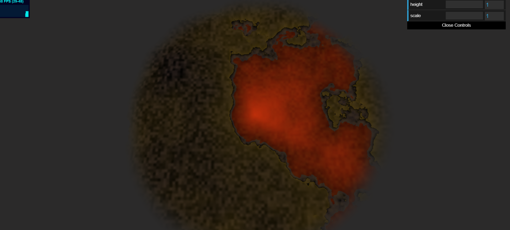
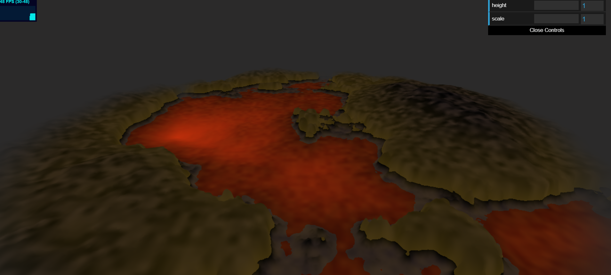
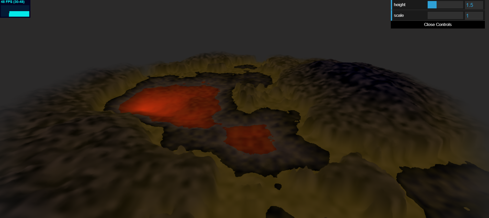
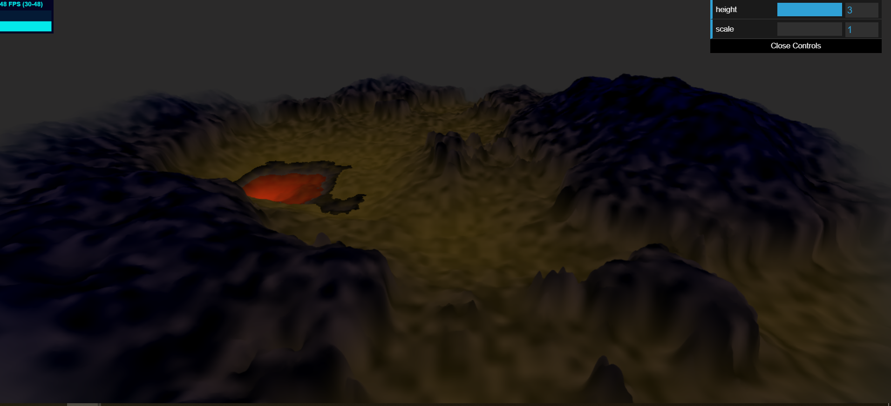
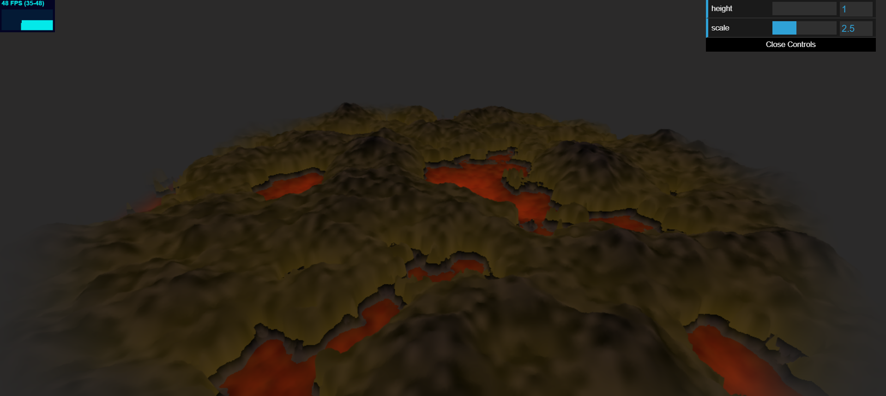
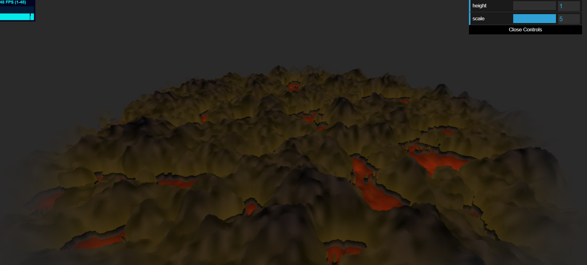

# CIS 566 Homework 1: Noisy Terrain

## Stephanie Goldberg - slgold
- Demo: https://slgold95.github.io/hw01-noisy-terrain/

## References
- Noise: https://thebookofshaders.com/11/
- Class Slides on Noise: https://docs.google.com/presentation/d/e/2PACX-1vQAK1Xeb7GGqLoDFz_iu9JuXMb-qE9jqKbZDkrXNSybXweqeIn3xvv4LMxetcM9GEugoU0Q0Ft1qUH-/pub?start=false&loop=false&delayms=60000&slide=id.g4cae677c4f_0_852

## Noise Functions
- Fractal Brownian Motion and 2D Noise Interpolation: Used Fractal Brownian Motion combined with exponential functions, 2D Noise Interpolations, and smoothstep interpolations to generate the heights for the height map.

- Perlin Noise: Used Perlin Noise to create a noise vector to combine with specified colors for different height ranges to color based on.
 

## GUI 
- Slider to modify height of terrain: The higher the slider value, the more raised the terrain becomes. This may eliminate areas of lava pools.

- Slider to modify scale of terrain: The higher the slider value, the more crunched together the terrain becomes. The terrain can shrink or grow out of a certain point (best to use this slider when you refresh the page or first load it up, so that the camera isn't moved and you can view from the point of growth).

